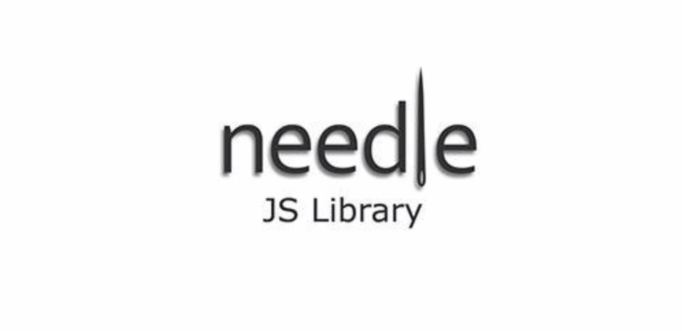

<div align="center">
<h1>NeedleJS</h1>
<p>
  <strong>An effort for a Class like Object oriented javascript framework.</strong>
</p>

  
</div>

NeedleJS is an Object oriented javascript framework, realizing the notion of classes. Its goal is to split logic and complexity between different files (classes), which then can be requested dynamically and extended if needed.

NeedleJS exposes two global variables - NEEDLE and N (second one is exposed if window.N isn't occupied).
A core file is present containing all features needed to request, extend and implement the rest of the classes.

## Classes in NeedleJS are constructor functions, having
* private methods;
* public methods;
* public properties;
* private properties;
* constants;
* static methods;
* static properties;
* constructors;

## Structure
* Contains several files.
* Each file has the same name as the name of the class inside.
* Each class can be requested by NEEDLE.require() or N.require() method.
* Classes then load in an order they have been requested.
* All classes can be extended.
* All base classes inherit from NEEDLE.Object class.
* Custom user classes can extend one or more base classes.

## NeedleJS currently covers these browsers
* IE 7+
* Opera 9.5+
* Chrome
* Safari 3+
* Firefox 3 (not fully tested)

## How to use NeedleJS
1) Include Needle.js file into you HTML (just before the closing BODY tag):

```
<script id="needle" src="/path/to/Needle.js"><\script>
```

2) Request some base classes:

```
NEEDLE.require("DOM.js");
NEEDLE.require("Ajax.js");
```

3) Request your own classes:

```
NEEDLE.require("/path/to/MyClass.js");
```

_Note:_

Developers with different syntax preferences can still use NeedleJS classes, extend them, etc, though I personally encourage you to follow the classical syntax as it is clear and visually appealing. Programming languages like PHP and Java are closer to NeedleJS as a class structure, that why you will be privileged if these languages are into your backpack.
NeedleJS is capable to achieve what other libraries like JQuery, MooTools, YUI, etc can. What makes it different is the way it encourages you to code.

## Current state
Library is no longer in development. It was built in time when it was not easy to write class like code in javascript.
Nowadays _Typescript_ and _Coffeescript_ achieve what NeedleJS did. Module approach in ES6 allows to import functionality in closed scope - therefore no `NEEDLE.require()` is needed.

## License
[MIT](LICENSE)
